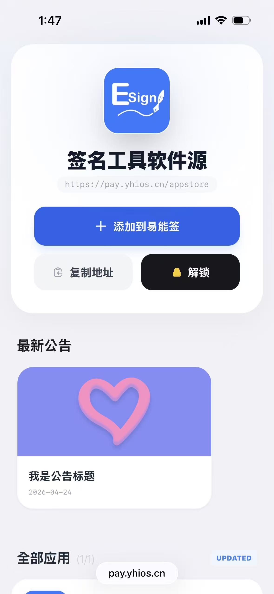
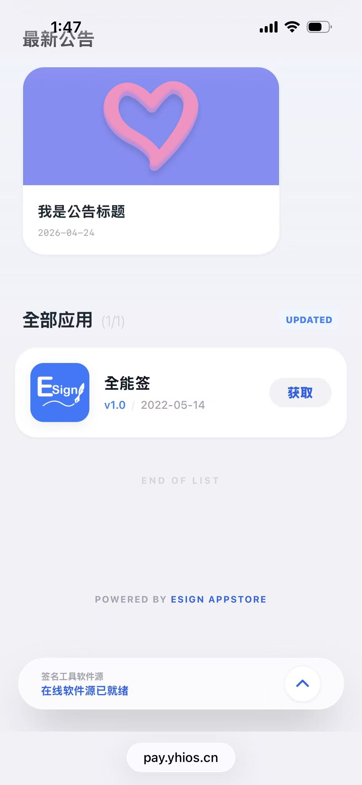
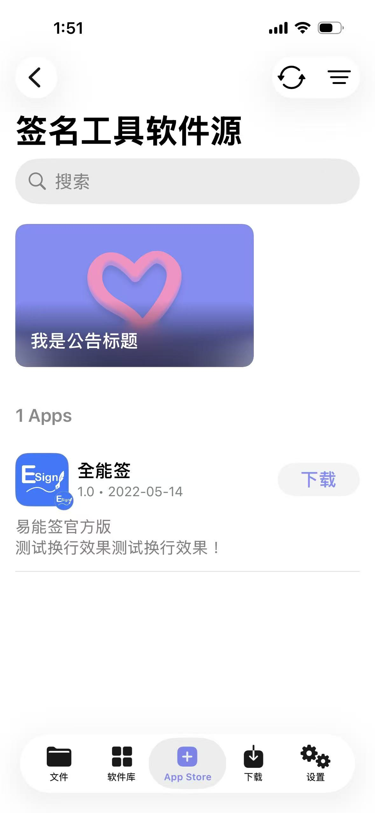

# 🚀 NSK QNQ AppStore 软件源管理系统 (二开优化版)

本项目适配 **易能签 (ESign)** 基于宝塔一键部署镜像 `nsk_qnq_appstore` 进行深度二次开发。旨在为易能签用户提供更极致、更原生的软件源托管体验。

易能签(ESign)官网：[www.enqapp.com](https://www.enqapp.com)

---

## ✨ 界面预览

### Web 端适配预览
| 移动端前端展示 | 移动端详情/交互 |
| :---: | :---: |
|  |  |

### 易能签 (ESign) 内效果预览
| 易能签·新闻模块 | 易能签·源商店 |
| :---: | :---: |
|  |  |

---

## ✨ 二开特性

- 🎨 **深度适配易能签**：由易能签作者亲自操刀，UI 交互逻辑完全匹配易能签 App。
- 📰 **新增 News 模块**：完整支持易能签内的“新闻/公告”展示功能，支持图片、自定义主题色及点击跳转。
- 🎨 **全新 iOS 沉浸式 UI**：基于 Tailwind CSS 重新设计，完美适配 iPhone/iPad 灵动岛及底部横条。
- ⚡ **性能优化**：彻底移除远程更新检查逻辑，解决页面加载卡顿，确保私密性。
- 📱 **交互升级**：
  - **一键添加**：支持 `enq-app://` 协议，点击即刻跳转至易能签添加源。
  - **智能复制**：集成防抖处理的地址复制功能。
  - **动态导航**：自动显示/隐藏的“回到顶部”按钮。
- 📦 **自动分页**：采用 Intersection Observer 技术，支持海量 App 平滑滚动加载。

---

## 🛠 环境要求

| 环境项目 | 要求 |
| :--- | :--- |
| **PHP 版本** | **7.0 (推荐)** |
| **运行目录** | `/public` |
| **必须函数** | `putenv` (请在 PHP 禁用函数列表中删除此项) |
| **伪静态** | ThinkPHP (必须设置) |
| **安全传输** | 必须开启 **HTTPS/SSL** |

---

## 🚀 部署指南

1. **基础安装**：上传源码，设置运行目录为 `/public`。
2. **伪静态设置**：宝塔面板请选择 `thinkphp` 规则。
3. **开启 HTTPS**：必须配置 SSL 证书，否则易能签内无法正常拉取图标及 IPA。
4. **数据库配置**：修改 `application/database.php` 中的数据库连接信息。

---

## 📄 JSON 结构示例 (含 News 模块)

系统生成的源地址将包含以下格式的 JSON 数据，确保兼容易能签的各项高级特性：

```json
{
  "name": "签名工具软件源",
  "identifier": "软件源标识符，填你想填的",
  "sourceURL": "https://pay.yhios.cn/appstore",
  "sourceicon": "https://pay.yhios.cn/uploads/20260424/43810b6c2a0e2fc30f7184f044391cdd.png",
  "website": "https://enqapp.com",
  "message": "软件来源：填写软件源地址\r\n解锁发卡地址：填写用户购买卡密的发卡地址\r\n解锁接口地址：如用本源生成卡密，则解锁接口地址就填写源地址\r\n例如：http://test.enqapp.com/appstore\r\n源识别标符：随意填写，也可填写源地址",
  "payURL": "https://www.baidu.com",
  "unlockURL": "https://pay.yhios.cn/appstore",
  "apps": [
    {
      "name": "全能签",
      "type": 0,
      "version": "1.0",
      "versionDate": "2022-05-14T17:22:48+08:00",
      "localizedDescription": "易能签官方版\n测试换行效果测试换行效果！",
      "lock": "0",
      "downloadURL": "https://enqapp.com/enq.ipa",
      "isLanZouCloud": "0",
      "iconURL": "https://pay.yhios.cn/uploads/20260424/43810b6c2a0e2fc30f7184f044391cdd.png",
      "tintColor": "",
      "size": "0"
    }
  ],
  "news": [
    {
      "title": "我是公告标题",
      "identifier": "my.enqapp.one",
      "caption": "我是公告详细内容",
      "tintColor": "#848ef9",
      "imageURL": "http://pay.yhios.cn/uploads/20260424/afed8a8491735dfcd8904dc78a31c44e.png",
      "date": "2026-04-24",
      "url": "https://enqapp.com",
      "notify": true
    }
  ]
}
```

---

## 🔐 后台管理

- **管理地址**：`您的域名/FRKToHDckx.php`
- **初始账号**：`admin`
- **初始密码**：`123456`

> [!CAUTION]
> **安全提醒**：部署完成后，请务必第一时间登录后台修改默认管理员密码！

---

## 🤝 关于易能签 (ESign)

**易能签·ESign** 是一款 iOS 免费签名工具，支持签名安装未上架 App Store 的内测应用程序。
- **官方网站**：[enqapp.com](https://enqapp.com)
- **郑重声明**：严禁使用本工具签名外挂、违规或侵权应用。

---

## 🤝 鸣谢与声明

1. **原作者致谢**：本项目基于宝塔 `nsk_qnq_appstore` 原型进行适配开发。
2. **开源说明**：本项目仅供技术交流与学习使用，请勿用于任何形式的商业盈利行为。
3. **免责声明**：使用本源码产生的任何法律纠纷由使用者自行承担。

---
Generated with ❤️ by **ESign Author** (cc158999)